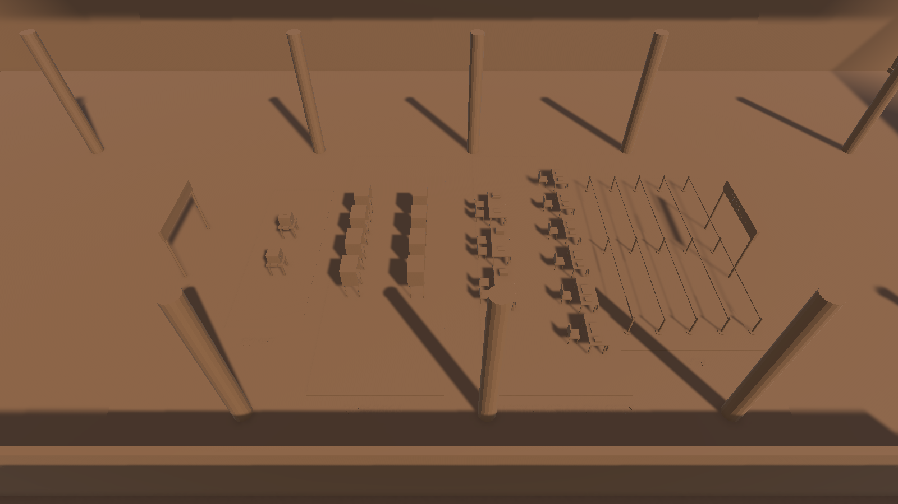

# Simulación multiagente de una casilla electoral

Proyecto académico que modela una casilla electoral mediante agentes, eventos discretos y una visualización 3D en Unity. Python representa llegadas, filas, atención, rechazos y eventos externos; Unity representa el escenario y mueve visualmente a los votantes entre las etapas.

> **Estado actual:** el motor de Python y la escena de Unity funcionan por separado. Unity incluye un modo de demostración y está preparado para consumir `GET /get_agents`, pero el servidor HTTP que une ambos componentes todavía está pendiente.



## Objetivo

La simulación permite experimentar con una casilla sin intervenir en un sistema real y estudiar preguntas como:

- ¿Dónde se forman los cuellos de botella?
- ¿Cómo cambia la espera al modificar la capacidad de una estación?
- ¿Qué ocurre cuando una credencial es rechazada?
- ¿Cómo afecta un corte de luz, temblor o aguacero?
- ¿Cuántos votantes completan el proceso durante la jornada?

## Arquitectura

```text
PYTHON / MESA
Agentes + filas FIFO + reloj de eventos + probabilidades
                         │
                         │ GET /get_agents (pendiente)
                         ▼
CONTRATO JSON
SimulationSnapshot + AgentSnapshot + ExternalEventSnapshot
                         │
                         ▼
UNITY
Estado lógico → punto del escenario → movimiento suave
                         │
                         ▼
Entrada → Secretario → Mesa → Mampara → Urna → Salida
```

- **Python decide qué ocurre:** llegadas, tiempos, filas, turnos, rechazos y eventos.
- **Unity decide cómo se ve:** posiciones, movimiento, cámara, iluminación, materiales e interfaz.
- Unity no vuelve a calcular la simulación y Python no necesita conocer coordenadas 3D.

## Funcionalidad implementada

### Motor de Python

- Votantes implementados como agentes de Mesa.
- Llegadas generadas como proceso de Poisson mediante tiempos exponenciales.
- Cuatro estaciones: secretario, mesa, casilla y urna.
- Capacidad configurable y filas FIFO independientes.
- Tiempos de atención aleatorios uniformes.
- Mensajes explícitos `TURN`, `WAIT`, `REJECTED`, `PAUSE` y `RESUME`.
- Probabilidad configurable de rechazo de credencial.
- Coordinador que comunica eventos externos a todas las estaciones.
- Eventos externos: `corte_de_luz`, `temblor` y `aguacero`.
- Reloj discreto que avanza directamente al siguiente evento.
- Registro cronológico en `event_log`.
- 15 pruebas automatizadas.

### Escena de Unity

- Escena principal `PollingStationAndares.unity`.
- Modelo de Blender importado como FBX.
- Anchors de entrada, salida, filas y servicio reutilizados desde el modelo.
- Una sola representación visual por identificador de votante.
- Movimiento suave con `Vector3.MoveTowards`.
- Color permanente por votante.
- Soporte para todos los estados electorales acordados.
- Generación de posiciones adicionales cuando una fila crece.
- Retención breve y reciclaje de agentes rechazados o que salieron.
- Zona `Fallback` para estados desconocidos.
- Modo de demostración sin backend.
- Cliente HTTP preparado para `/get_agents`.
- Reloj, contadores, estado de conexión y aviso de evento externo.
- Cambio de iluminación durante un corte de luz.
- Cámara, señalización, flechas y marcas de espera.
- Placeholders reemplazables para los assets definitivos.

## Recorrido del votante

```text
arrived
   ↓
esperando_secretario → en_secretario
   ↓
esperando_mesa       → en_mesa
   ↓
esperando_casilla    → en_casilla
   ↓
esperando_urna       → en_urna
   ↓
salio

Rama alternativa:
en_secretario → rechazado
```

En Python, una estación envía `WAIT` cuando no tiene capacidad y `TURN` cuando comienza la atención. Unity traduce el estado a un destino visual; no altera la decisión.

## Estructura

```text
backend/
├── casilla/
│   ├── agents.py                 Agentes, estaciones, mensajes y coordinador
│   └── model.py                  Modelo, eventos, llegadas y transiciones
├── tests/test_casilla_model.py   Pruebas automatizadas
├── main.py                       Demostración en consola
└── requirements.txt

client-csharp/
└── Program.cs                    Cliente HTTP de referencia

unity-client/MultiAgent-simulation/
├── Assets/
│   ├── Editor/PollingStationSceneBuilder.cs
│   ├── Models/PollingStation/casilla_votacion.fbx
│   ├── Prefabs/PollingStation/   Placeholders reemplazables
│   ├── Scenes/
│   │   ├── PollingStationAndares.unity
│   │   └── SampleScene.unity     Respaldo original
│   ├── Scripts/Simulation/
│   │   ├── SimulationContracts.cs
│   │   ├── SimulationStateProvider.cs
│   │   ├── AgentViewManager.cs
│   │   ├── AgentView.cs
│   │   ├── SceneLayout.cs
│   │   └── ExternalEventVisualizer.cs
│   └── Tests/EditMode/
├── Tools/Blender/export_casilla_to_unity.py
└── UNITY_INTEGRATION.md          Guía detallada de integración
```

## Requisitos

- Python 3.12 o compatible.
- Unity `6000.4.2f1` o una versión compatible de Unity 6.
- Git para clonar el repositorio; el FBX y las imágenes se almacenan como archivos normales.
- Blender sólo para volver a exportar el archivo fuente.
- .NET 9 únicamente para el cliente C# de consola.

## Ejecutar Python

Desde la raíz:

```powershell
cd backend
python -m venv .venv
.\.venv\Scripts\python.exe -m pip install -r requirements.txt
.\.venv\Scripts\python.exe main.py
```

Ejemplo reproducible:

```powershell
.\.venv\Scripts\python.exe main.py --num-voters 30 --arrival-rate 0.5 --seed 7
```

| Parámetro | Descripción |
|---|---|
| `--num-voters` | Cantidad de votantes programados. |
| `--arrival-rate` | Tasa promedio de llegadas por minuto. |
| `--seed` | Semilla para repetir un experimento. |
| `--secretario-capacity` | Capacidad simultánea del secretario. |
| `--mesa-capacity` | Capacidad simultánea de la mesa. |
| `--casilla-capacity` | Cantidad de mamparas disponibles. |
| `--urna-capacity` | Cantidad de urnas disponibles. |
| `--rejection-rate` | Probabilidad de rechazo de la credencial. |

### Pruebas de Python

```powershell
cd backend
.\.venv\Scripts\python.exe -m pytest -v
```

La suite verifica orden cronológico, empates, llegadas probabilísticas, recorrido, rechazo, capacidades, filas FIFO y pausa/reanudación por evento externo.

## Ejecutar Unity

1. Agregar `unity-client/MultiAgent-simulation` desde Unity Hub.
2. Abrir el proyecto con Unity 6.
3. Abrir `Assets/Scenes/PollingStationAndares.unity`.
4. Presionar **Play**.

Mientras no exista el servidor HTTP aparecerá:

```text
Modo demostración (sin backend)
```

Este modo genera estados ficticios para comprobar escena y movimiento. No son resultados de Python.

### Reconstruir la escena

Después de modificar el FBX o el generador:

1. Detener **Play**.
2. Elegir **Tools → Polling Station → Build Andares Scene**.
3. Abrir nuevamente `PollingStationAndares.unity`.

El generador conserva `SampleScene` como respaldo y crea materiales, placeholders, jerarquía, puntos, cámara, iluminación e interfaz.

## Contrato para conectar Python y Unity

Unity está preparado para consultar:

```text
GET http://127.0.0.1:5000/get_agents
```

Respuesta esperada:

```json
{
  "step": 12,
  "simulation_time": 42.5,
  "running": true,
  "paused": false,
  "external_event": {
    "active": false,
    "kind": "",
    "remaining": 0.0
  },
  "agents": [
    {
      "id": 17,
      "state": "esperando_urna",
      "station": "urna",
      "queue_position": 2
    }
  ]
}
```

Reglas:

- `queue_position` comienza en cero.
- Si falta, Unity asigna provisionalmente el primer lugar libre.
- `state` también puede recibirse temporalmente como `status`.
- `salio` y `rechazado` permanecen dos actualizaciones antes de reciclarse.
- Un estado desconocido utiliza `Fallback` sin detener la escena.
- Python debe marcar `voter.status = "salio"` al terminar.
- Para activar el backend se implementa el endpoint y se cambia `useMockData` a `false`.

## Assets definitivos

El escenario detallado procede del archivo Blender entregado por el equipo. Este repositorio no reclama autoría sobre esos modelos; la implementación realizada los exporta, configura y conecta con la simulación.

Los reemplazos deben usar preferentemente:

- Escala aproximada en metros.
- Pivote al nivel del piso.
- Orientación frontal hacia `+Z`.
- Materiales independientes.
- Colliders sencillos cuando sean necesarios.

```text
VoterPlaceholder       → persona
SecretaryPlaceholder   → funcionario
TablePlaceholder       → mesa
BoothPlaceholder       → mampara
BallotBoxPlaceholder   → urna
```

Anchors utilizados:

```text
SPAWN / EXIT
QUEUE_GENERAL_*
QUEUE_MESA_*
QUEUE_CASILLA_*
QUEUE_URNA_*
SLOT_SECRETARIO_*
SLOT_MESA_*
SLOT_CASILLA_*
SLOT_URNA_*
```

## Trabajo pendiente

- Crear el servidor Flask o equivalente.
- Mantener disponibles los votantes activos.
- Calcular `queue_position` desde las filas reales de Python.
- Exponer el evento externo y su tiempo restante.
- Marcar explícitamente el estado `salio`.
- Desactivar los datos de demostración.
- Probar reinicio, JSON inválido y reconexión.
- Sustituir placeholders por los assets definitivos.
- Comparar métricas de varios escenarios.

## Verificación actual

- Python: **15 pruebas automatizadas aprobadas**.
- Unity: **4 pruebas EditMode aprobadas** para contratos, filas y reciclaje.
- La escena funciona en modo de demostración.
- El modelo FBX, anchors y materiales fueron importados.
- El puente HTTP definitivo todavía está pendiente.

## Colaboración y reconocimiento

Antes de modificar la integración, revisar [UNITY_INTEGRATION.md](unity-client/MultiAgent-simulation/UNITY_INTEGRATION.md). Se recomienda separar cambios del backend, puente y assets para reducir conflictos.

Este es un trabajo colaborativo del equipo del RETO. El modelo tridimensional fuente fue proporcionado por el equipo. Se utilizaron herramientas de inteligencia artificial como apoyo para analizar, implementar, depurar y documentar; los integrantes deben revisar y comprender el funcionamiento antes de presentarlo.
